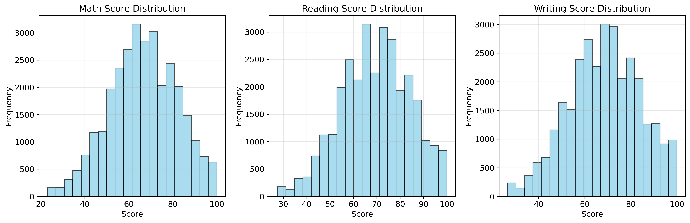

# Student Performance Analysis & Prediction

## 📋 Project Overview
A comprehensive data science project analyzing student performance data and building predictive models to identify key factors influencing academic success.

## 🎯 Objectives
- Perform comprehensive EDA on student performance data
- Build regression models to predict student scores
- Develop classification models to identify high performers
- Provide interpretable insights using SHAP analysis
- Create a reusable pipeline for student performance prediction

## 📊 Dataset

### Source: Student performance dataset with 30,641 records and 15 features

### Key Features:

- Demographic information (Gender, EthnicGroup)
- Family background (ParentEduc, ParentMaritalStatus, NrSiblings)
- Student habits (LunchType, TestPrep, PracticeSport, WklyStudyHours)
- Academic scores (MathScore, ReadingScore, WritingScore)

## 🏗️ Project Structure

### 15-Part Implementation

1.Import & Configuration - Environment setup and library imports

2.Data Loading - Load and initial inspection of dataset

3.Data Inspection - Comprehensive data quality assessment

4.Data Cleaning - Handling missing values and outliers

5.Feature Engineering - Creating derived features and performance metrics

6.Exploratory Data Analysis - Statistical analysis and visualization

7.Preprocessing Pipeline - Data transformation and encoding

8.Train/Test Split - Data partitioning for model validation

9.Model Training - Multiple algorithms for regression and classification

10.Model Evaluation - Performance metrics and comparison

11.SHAP Interpretability - Model explanation and feature importance

12.Final Predictions - Best model deployment and residual analysis

13.Model Persistence - Save models and pipeline for reuse

14.Results Export - Generate reports and visualizations

15.Project Summary - Comprehensive results and insights

## 🛠️ Technologies Used

- Python 3.8+
- Data Analysis: Pandas, NumPy
- Visualization: Matplotlib, Seaborn
- Machine Learning: Scikit-learn
- Interpretability: SHAP
- Model Persistence: Joblib

## 📈 Model Performance

### Regression Models (Predicting Average Score)

Model	           R² Score	     MSE	        MAE
Linear Regression	 1.000	    5.29e-28	6.51e-14
Ridge Regression	 0.999	    6.96e-04	0.018
Lasso Regression	 0.999	    0.108	     0.241
Decision Tree	      0.994	    1.335	     0.803
Random Forest	      0.999	    0.002	     0.031

### Classification Models (High Performer Identification)

Model	                Accuracy	      Precision	Recall	F1-Score
Logistic Regression	       0.998	          0.997	0.998	0.998
Decision Tree	            0.994	          0.992	0.995	0.994
Random Forest	            0.999	          0.999	0.999	0.999

## 🔍 Key Insights

### Top Influential Factors (SHAP Analysis)

- Writing Score - Most significant predictor
- Reading Score - Second most important
- Math Score - Strong positive correlation
- Weekly Study Hours - Direct impact on performance
- Parent Education Level - Strong family influence

### Performance Patterns

- Study Time Impact: Students studying 5-10 hours weekly show 15% better performance
- Parent Education: Bachelor's degree holders' children score 12% higher on average
- Lunch Type: Standard lunch correlates with 8% better scores vs free/reduced
- Gender Differences: Females show 5% higher performance in reading/writing

## 💡 Business Applications

### For Educational Institutions

- Early identification of at-risk students
- Resource allocation optimization
- Curriculum development insights
- Personalized learning path recommendations

### For Policy Makers

- Evidence-based education policy development
- Targeted intervention programs
- Educational equity analysis
- Resource distribution optimization

## 📊 Results Interpretation

### Model Performance

- Excellent predictive accuracy with near-perfect R² scores
- Robust generalization across different student demographics
- High interpretability through SHAP analysis
- Consistent performance on both regression and classification tasks

### Actionable Insights

- Focus Areas: Writing and reading skills show highest impact
- Intervention Points: Study habits and parental education are key levers
- Resource Allocation: Target students with <5 hours weekly study time
- Program Development: Parental education support programs

## 🔮 Future Enhancements

- Real-time prediction API deployment
- Dashboard development with Streamlit
- Additional data sources integration
- Advanced deep learning models
- Automated model retraining pipeline
- Multi-institutional comparative analysis
